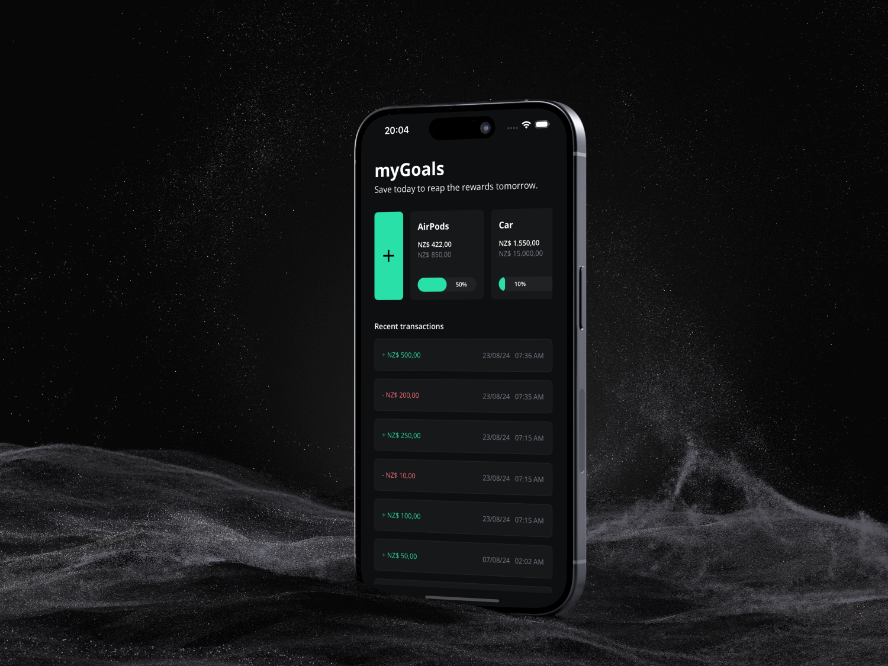
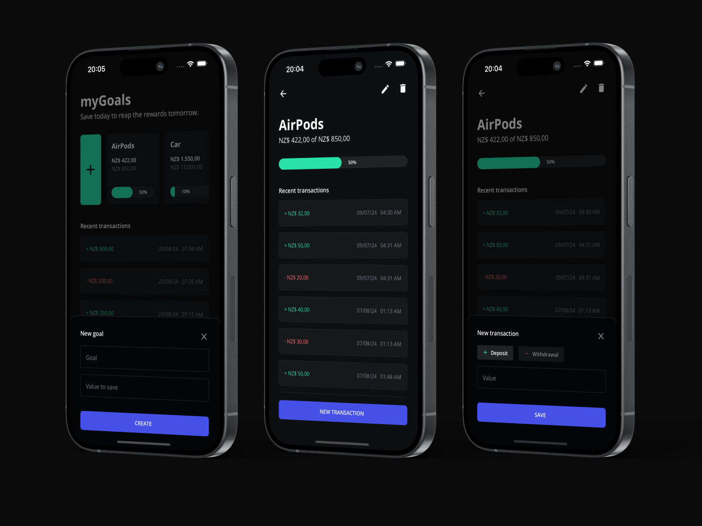

# myGoals App

A simple and intuitive React Native application for tracking goals. The app allows users to create, edit, delete, and monitor your goals with a user-friendly interface.

## 🚀 Technologies Used

- **React Native**
- **Expo**
- **TypeScript**
- **Day.js**
- **Expo SQLite (Next)**

## 💻 Features

- **Create Goals**: Add new goals with a target value.
- **View Goals**: Display a list of goals with current progress.
- **Edit Goals**: Modify the target value of existing goals.
- **Delete Goals**: Remove goals that are no longer needed.
- **Track Transactions**: Log transactions against goals to track progress, including withdraws and deposits.

##

## Usage

- **Create a Goal**: Use the 'New Goal' button to create a new goal with a name and target amount.
- **Edit a Goal**: Tap on an existing goal to open the bottom sheet, and modify the target value.
- **Delete a Goal**: Tap on an existing goal and tap the delete icon to remove it.
- **Track Progress**: Add transactions to your goals to track progress towards the target, choosing between withdraws or deposits.

 

---

_Thank you for checking it out! Feel free to submit issues, feature requests, and pull requests to contribute to the project._
